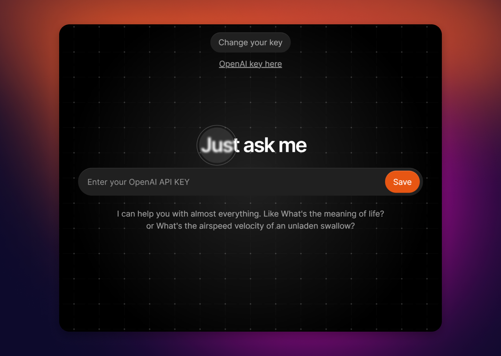

# Just ask me

Your own AI assistant with all the power of ChatGPT, based on Flask, HTML, Javascript and CSS

Build your own AI now!!

Check the [demo](https://twitter.com/SanxRoz/status/1635059072457392128)



## How it Works

Just ask me provides a simple, minimal and fully functional chat that you can use to build your own AI app powered by OpenAI.

Just plug and play, it has everything you need to start deploying.

To change the interface go to `api/templates/home.html`.

To modify your prompt or API go to `api/index.py`.

## Running Locally

```bash
npm i -g vercel
vercel dev
```

Your Flask application is now available at `http://localhost:3000`.

## One-Click Deploy

Deploy the example using [Vercel](https://vercel.com?utm_source=github&utm_medium=readme&utm_campaign=vercel-examples):

[](https://vercel.com/new/import?s=https%3A%2F%2Fgithub.com%2FSanxRoz%2Fask&hasTrialAvailable=1&showOptionalTeamCreation=false&project-name=just-ask&framework=other&totalProjects=1&remainingProjects=1)
